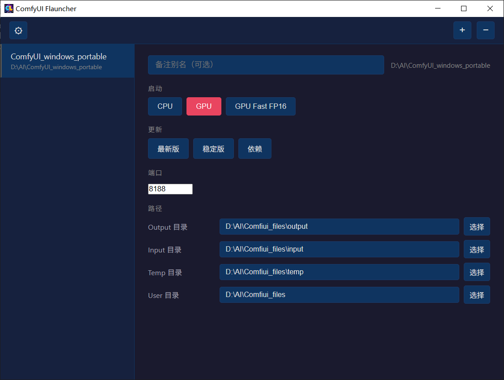

# ComfyUI Portable Launcher

A Tauri v2 desktop application for managing multiple ComfyUI portable instances on Windows.



## Features

- **Multi-instance management** — add, remove, and switch between ComfyUI portable installations
- **Launch modes** — CPU, GPU, GPU Fast FP16 (same as the original portable BAT files)
- **Update management** — update to latest, stable, or reinstall dependencies per instance
- **Custom paths** — per-instance `--output-directory`, `--input-directory`, `--temp-directory`, `--user-directory`
- **Independent ports** — each instance runs on a configurable port with conflict detection
- **System tray** — instance quick-launch and exits from the tray menu
- **Proxy support** — system proxy auto-detection or manual proxy for updates
- **Startup feedback** — yellow-black animated stripes during startup, turns green on success, auto-minimize to tray
- **JSON config** — stored in `%USERPROFILE%/.comfylauncher/config.json`

## Tech Stack

| Layer | Technology |
|-------|-----------|
| Desktop shell | [Tauri v2](https://v2.tauri.app) |
| Frontend | Vanilla JS (ES modules) |
| Backend | Rust (thin layer: system calls only) |
| Build | Vite |

## Usage

1. Download the latest release from [Releases](https://github.com/Martlet-Tech/ComfyUI-portable-launcher/releases)
2. Launch the app
3. Click **+** to add a ComfyUI portable directory
4. Select the instance and click **GPU** / **CPU** / **GPU Fast FP16** to start

## Build from source

```bash
git clone https://github.com/Martlet-Tech/ComfyUI-portable-launcher.git
cd ComfyUI-portable-launcher
npm install
npm run tauri
```

## License

MIT
