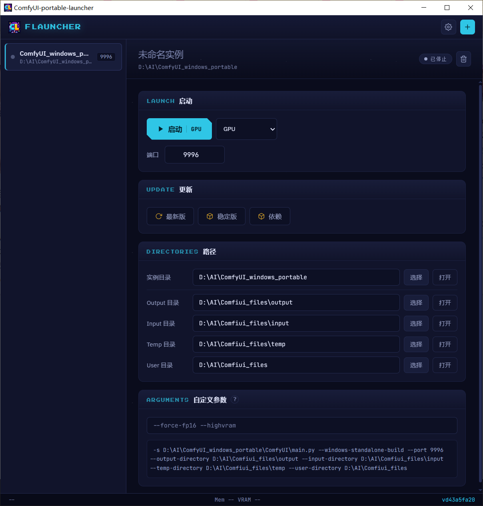

<p align="center">
  
</p>

<h1 align="center">ComfyUI Portable Launcher</h1>

<p align="center">
  <a href="https://github.com/Martlet-Tech/ComfyUI-portable-launcher/releases"></a>
  <a href="https://github.com/Martlet-Tech/ComfyUI-portable-launcher/actions/workflows/build.yml"></a>
  
  
  <a href="https://github.com/Martlet-Tech/ComfyUI-portable-launcher/stargazers"></a>
</p>

> 一个 Windows 桌面启动器:把多个 ComfyUI 便携版管得明明白白——多开、一键更新、更新自动走代理,彻底告别一堆 BAT 和命令行窗口。



## 为什么需要它

如果你手动部署过 ComfyUI 便携版,一定遇到过:

- 😫 开好几个实例,要复制 N 份目录、记住每个端口、互相抢端口
- 😫 `update_comfyui.bat` 更新**不走系统代理**,国内网络直连 GitHub 经常失败
- 😫 更新依赖要自己敲 `pip install`,还得开黑乎乎的命令行窗口
- 😫 装在托盘里的 ComfyUI 找不到入口,分不清哪个进程对应哪个实例

这个启动器就是为解决这些问题写的。

## ✨ 功能

**多实例管理**

- 无限多开:每个实例独立端口、独立输出/输入/缓存目录,端口冲突自动检测并拦截
- 一键切换,GPU / CPU / GPU Fast FP16 启动模式与原版 BAT 完全一致
- 自定义启动参数,实时预览完整命令行

**更新与代理**(v0.8.2 重点)

- 最新版 / 稳定版 / 仅依赖更新,三种模式一键操作
- 更新流量**自动走系统代理**——原理是把代理注入 pygit2 的 fetch(原版脚本用的 libgit2 不认环境变量代理,详见 [FAQ](#-faq))
- 代理支持系统代理自动探测、HTTP(S)、SOCKS5,内置连通性测试
- 补丁注入前自动备份原版脚本(`update.py.orig`),一键还原,安全可逆

**桌面级体验**

- 启动中黄黑条纹动画 → 就绪变绿 → 自动最小化到托盘,全程不用盯命令行
- 实时运行日志(ANSI 彩色)、内存/显存占用监控
- 托盘菜单快速启动任意实例
- 绿色单文件,配置存于 `%USERPROFILE%/.comfylauncher/config.json`

## 🚀 快速开始

1. 从 [Releases](https://github.com/Martlet-Tech/ComfyUI-portable-launcher/releases) 下载最新的 `exe`
2. 运行,点右上角 **+** 选择你的 ComfyUI 便携版目录(含 `ComfyUI\main.py` 和 `python_embeded` 的那种)
3. 点 **GPU** 启动,浏览器打开 `http://127.0.0.1:端口` 即可出图

## 🔄 更新为什么能走代理?

ComfyUI 便携版自带的 `update.py` 通过 **pygit2(libgit2)** 拉取代码,而 libgit2 默认不读取 `HTTP_PROXY` 等环境变量,也不读 Windows 系统代理——这就是"明明挂了代理,更新还是失败/巨慢"的根因。

本启动器的做法:

1. 更新前自动在 `update/update.py` 中注入一段标记包裹的补丁,让 `Remote.fetch` 显式使用代理
2. 注入前先把原版备份为 `update.py.orig`,随时可在界面上一键还原
3. ComfyUI 官方的自更新机制覆盖脚本后,下次更新会自动重新注入

## ❓ FAQ

**Q: 会改动我的 ComfyUI 吗?**
A: 只会触碰 `update/update.py` 一个文件(且带备份),ComfyUI 本体、模型、节点一概不动。

**Q: 端口被占用怎么办?**
A: 启动前会自动检测冲突并弹窗拦截,改个端口再启动即可。

**Q: 数据存在哪?**
A: `%USERPROFILE%\.comfylauncher\config.json`,纯 JSON,随时可以备份或手改。

**Q: 和 ComfyUI Desktop / 官方启动器什么区别?**
A: 面向"便携版解压即用"的用户:不装安装器、不动 Python 环境、每个实例完全独立,和原版 BAT 的行为 100% 一致,只是把 BAT 换成了图形界面。

## 🛠 从源码构建

```bash
git clone https://github.com/Martlet-Tech/ComfyUI-portable-launcher.git
cd ComfyUI-portable-launcher
npm install
npm run tauri dev    # 开发调试
npx tauri build      # 构建发布
```

## English

A Windows desktop launcher for managing **multiple ComfyUI portable instances**: independent ports and directories, one-click updates (latest / stable / dependencies), and updates that **automatically go through your system proxy** — the bundled `update.py` uses pygit2/libgit2, which ignores proxy environment variables by default; the launcher injects a reversible, backed-up patch that routes its fetch through your proxy. Built with Tauri v2 (Rust + vanilla JS). See the release page for downloads; config lives in `%USERPROFILE%/.comfylauncher/config.json`.

## 📄 License

[MIT](LICENSE)
